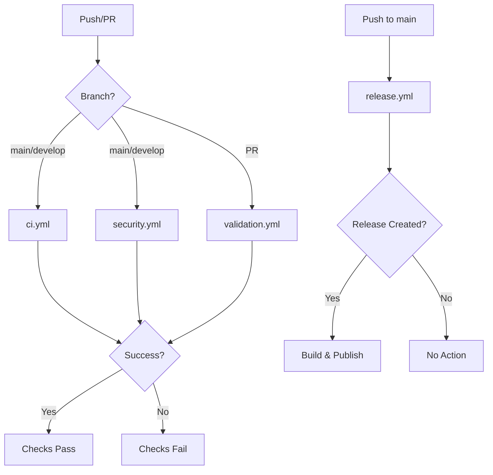

# GitHub Actions Workflows

This repository uses a simplified set of GitHub Actions workflows designed for easy configuration of required status checks and efficient CI/CD operations.

## 🎯 Overview

Four focused workflows handle all development and release processes:

- **`ci.yml`** - Continuous Integration (testing, linting, building)
- **`security.yml`** - Security scanning and vulnerability checks
- **`validation.yml`** - Code quality and documentation validation
- **`release.yml`** - Automated releases and asset publishing

## 📋 Workflow Details

### 1. `ci.yml` - Continuous Integration

**Triggers**: Push to `main`/`develop`, Pull Requests

**Main Job: `ci`** ⭐ *Recommended for required status checks*
- Go module validation and dependency verification
- Code formatting checks (`gofmt`)
- Static analysis with `go vet`
- Linting with `golangci-lint`
- Unit tests with race detection and coverage
- Build verification
- Coverage reporting to Codecov

**Optional Jobs**:
- `test-matrix` - Cross-platform testing (Ubuntu, macOS, Windows) with multiple Go versions
- `integration` - Integration tests with Docker services

**Label Triggers**:
- Add `test-matrix` label to PR to run cross-platform tests
- Add `integration` label to PR to run integration tests

### 2. `security.yml` - Security Scanning

**Triggers**: Push to `main`/`develop`, Pull Requests, Weekly schedule

**Main Job: `security`** ⭐ *Recommended for required status checks*
- Gosec security scanner for Go code vulnerabilities
- Go vulnerability database checking with `govulncheck`
- Secret scanning with TruffleHog
- Basic security pattern detection
- Hardcoded credential checks
- Unsafe function usage detection

**Optional Jobs**:
- `advanced-security` - CodeQL static analysis (scheduled or label-triggered)

**Label Triggers**:
- Add `security-deep-scan` label to PR for advanced CodeQL analysis

### 3. `validation.yml` - Code & Documentation Validation

**Triggers**: Pull Requests, Push to `main`/`develop` (for docs)

**Main Job: `validation`** ⭐ *Recommended for required status checks*
- Conventional commit validation (PRs only)
- Configuration file consistency checks
- Markdown linting and formatting
- Broken link detection in documentation
- Code quality checks (TODO/FIXME comments)
- File permission validation

**Optional Jobs**:
- `docs` - Documentation site generation and GitHub Pages deployment (main branch only)

### 4. `release.yml` - Release Management

**Triggers**: Push to `main`, Manual workflow dispatch

**Jobs**:
- `release` - Creates releases using release-please based on conventional commits
- `build` - Builds and publishes cross-platform binaries and Docker images (when release created)
- `post-release` - Package manager updates and notifications

**Features**:
- Automatic semantic versioning
- Cross-platform binary builds (Linux, macOS, Windows)
- Multi-architecture Docker images (amd64, arm64)
- Checksum generation and verification
- GitHub Container Registry publishing
- Release asset validation

## 🔧 Required Status Checks Setup

Configure branch protection rules in GitHub Settings → Branches:

### Minimal Protection
```
ci
```

### Recommended Protection (Balance of speed and coverage)
```
ci
security
validation
```

### Maximum Protection (Comprehensive checks)
```
ci
security
validation
test-matrix
integration
advanced-security
```

## 🏷️ Pull Request Labels

Use these labels to trigger additional checks:

| Label | Effect |
|-------|--------|
| `test-matrix` | Runs cross-platform/multi-version testing |
| `integration` | Runs integration tests with Docker |
| `security-deep-scan` | Triggers CodeQL advanced security analysis |

## 🎛️ Customization

### Adjusting Workflow Triggers

Edit the `on:` sections in workflow files:

```yaml
on:
  push:
    branches: [main, develop]  # Modify branch names
  pull_request:
    branches: [main, develop]
    paths:                     # Add path filters
      - "src/**"
      - "*.go"
```

### Disabling Optional Jobs

Remove or comment out jobs you don't need:
- Remove `test-matrix` from `ci.yml` if cross-platform testing isn't required
- Remove `advanced-security` from `security.yml` if CodeQL isn't needed
- Remove `docs` from `validation.yml` if documentation deployment isn't required

### Security Tool Configuration

Customize security scanning:
- Edit `.gosec.conf` for Gosec configuration
- Modify secret patterns in `security.yml`
- Adjust vulnerability check settings

## 📊 Workflow Execution Flow



## 🚀 Benefits

1. **Simplified Management**: Only 3-4 required status checks instead of 20+
2. **Faster Feedback**: Consolidated jobs reduce overall execution time
3. **Clear Separation**: Each workflow has a focused responsibility
4. **Flexible Requirements**: Choose protection level based on project needs
5. **Label-Driven**: Optional expensive checks triggered only when needed

## 🔧 Maintenance

### Regular Updates
- Keep action versions current (Dependabot helps with this)
- Update Go versions in `.go-version` file
- Review and update security tool configurations
- Monitor workflow execution times and optimize as needed

### Monitoring
- Check workflow success rates in Actions tab
- Review security scan results regularly
- Monitor release automation functionality
- Verify documentation deployment works correctly

## 🆘 Troubleshooting

### Common Issues

**Action not found**: Ensure `.github/actions/setup-go-version` exists and is properly configured

**Permission denied**: Check workflow permissions in YAML files and repository settings

**Tool failures**: Verify all required tools are installed in workflow steps

**Build failures**: Check Go version compatibility and dependency issues

### Getting Help

1. Review workflow logs in the Actions tab for detailed error information
2. Check individual job steps for specific failure points
3. Validate YAML syntax if workflows don't trigger
4. Test changes in feature branches before applying to protected branches