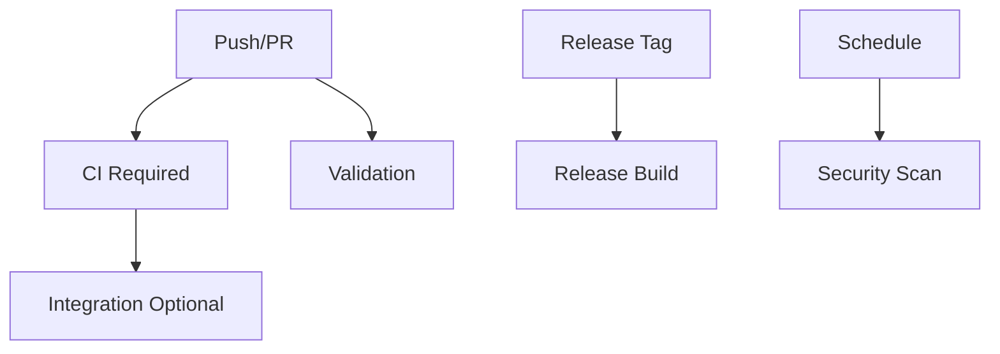

# GitHub Actions Workflows

This document describes the GitHub Actions workflows that automate testing, security scanning, documentation generation, and releases for the dev-stack project.

## Overview

The workflows are designed around the Go-based CLI implementation and support the complete development lifecycle from code validation to release automation.

## Workflows

### 🔄 CI Pipeline (`ci.yml`)

**Triggers**: Push to `main`/`develop`, Pull Requests
**Purpose**: Comprehensive continuous integration checks

#### Jobs

**`ci` (Required Status Check)**
- **Go Module Validation**: Ensures `go.mod` and `go.sum` are up-to-date
- **Code Formatting**: Validates `gofmt` compliance
- **Static Analysis**: Runs `go vet` for code quality
- **Linting**: Uses `golangci-lint` with 5-minute timeout
- **Unit Testing**: Executes race-condition-aware tests with coverage
- **Build Verification**: Compiles Go binary and verifies functionality
- **Coverage Upload**: Sends test coverage to Codecov

**`test-matrix` (Optional)**
- **Cross-Platform Testing**: Tests on Ubuntu, macOS, Windows
- **Go Version Matrix**: Tests against Go 1.21 and 1.22
- **Trigger**: Auto on push, manual via `test-matrix` label
- **Platform-Specific Builds**: Creates OS-specific binaries for validation

**`integration` (Optional)**
- **Docker-in-Docker**: Tests containerized workflows
- **Real Environment**: Validates against actual Docker services
- **Trigger**: Auto on push, manual via `integration` label
- **Dependency**: Requires `ci` job completion

#### Artifacts
- Build artifacts stored for 7 days
- Coverage reports uploaded to Codecov
- Cross-platform binaries for validation

### 🛡️ Security Scanning (`security.yml`)

**Triggers**: Schedule (weekly), Manual dispatch, Security PRs
**Purpose**: Automated security vulnerability detection

#### Jobs

**`security-scan`**
- **Dependency Scanning**: Uses GitHub's security advisories
- **Static Code Analysis**: Runs `gosec` for Go security issues
- **License Compliance**: Validates dependency licenses
- **Vulnerability Database**: Checks against known CVEs
- **SARIF Upload**: Results uploaded to GitHub Security tab

#### Features
- Weekly automated scans (Sundays at 2 AM UTC)
- Manual trigger capability for immediate scans
- Integration with GitHub Security Advisories
- Detailed security reporting in SARIF format

### ✅ Validation (`validation.yml`)

**Triggers**: Pull Requests, Manual dispatch
**Purpose**: Code quality and standards validation

#### Jobs

**`validate`**
- **Documentation Sync**: Verifies docs are up-to-date with code
- **Configuration Validation**: Checks YAML manifests
- **Link Validation**: Ensures documentation links work
- **Go Version Consistency**: Validates `.go-version` across configs
- **License Headers**: Checks for proper license attribution

#### Validation Checks
- Generated documentation is current (`make docs`)
- Service and command YAML manifests are valid
- Internal and external links in documentation
- Consistent Go version across all configuration files
- Proper file formatting and structure

### 🚀 Release (`release.yml`)

**Triggers**: Release tags (`v*`), Manual dispatch
**Purpose**: Automated release and distribution

#### Jobs

**`release`**
- **Multi-Platform Builds**: Linux, macOS, Windows (AMD64/ARM64)
- **Binary Packaging**: Creates platform-specific archives
- **GitHub Release**: Automated release creation with changelog
- **Asset Upload**: Distributes binaries for all platforms
- **Checksum Generation**: SHA256 checksums for verification

#### Release Assets
```
dev-stack-linux-amd64.tar.gz
dev-stack-linux-arm64.tar.gz
dev-stack-darwin-amd64.tar.gz
dev-stack-darwin-arm64.tar.gz
dev-stack-windows-amd64.zip
dev-stack-windows-arm64.zip
checksums.txt
```

## Shared Actions

### 📦 Setup Go Version (`.github/actions/setup-go-version`)

**Purpose**: Consistent Go environment setup across workflows

#### Features
- Reads Go version from `.go-version` file
- Configures Go cache for dependency optimization
- Sets up GOPATH and module proxy
- Ensures consistent environment across all jobs

#### Usage
```yaml
- name: Setup Go
  uses: ./.github/actions/setup-go-version
  id: setup-go
```

## Configuration Files

### 🔧 Dependabot (`dependabot.yml`)

**Purpose**: Automated dependency updates

#### Monitored Dependencies
- **Go Modules**: Weekly updates for `go.mod`
- **GitHub Actions**: Monthly updates for workflow actions
- **Docker**: Weekly updates for container dependencies

#### Configuration
- Automatic security updates enabled
- Grouped updates for related dependencies
- PR limit: 5 open PRs maximum
- Custom commit message format for consistency

### 🔗 Link Checking (`markdown-link-check.json`)

**Purpose**: Documentation link validation configuration

#### Settings
- Timeout: 10 seconds per link
- Retry attempts: 3
- Ignore patterns for localhost and placeholders
- Custom headers for authenticated endpoints

## Development Workflow

### 🚦 Required Status Checks

For branch protection, enable these required checks:
- `CI / ci` - Core CI pipeline
- `Validation / validate` - Code quality validation

### 🏷️ Optional Triggers

Use PR labels to trigger additional workflows:
- `test-matrix` - Runs cross-platform testing
- `integration` - Executes integration tests
- `security` - Triggers immediate security scan

### 🔄 Workflow Dependencies



## Local Development

### 🛠️ Reproduce CI Locally

```bash
# Run the same checks as CI
make test              # Unit tests with coverage
make lint              # Linting and static analysis
make build             # Build verification
make docs              # Documentation generation
```

### 🔍 Debug Build Issues

```bash
# Build for specific platform
GOOS=linux GOARCH=amd64 make build

# Verbose build output
go build -v -x ./cmd/dev-stack

# Check module consistency
go mod tidy && git diff go.mod go.sum
```

## Security Considerations

### 🔐 Secrets Management

No secrets are required for basic CI/CD operations. All workflows use:
- `GITHUB_TOKEN` (automatic)
- `CODECOV_TOKEN` (optional, for coverage)

### 🛡️ Permissions

Workflows use minimal required permissions:
- `contents: read` - For repository access
- `actions: read` - For workflow metadata
- `security-events: write` - For security scan results

### 🚨 Security Scanning

Weekly automated scans check for:
- Known vulnerabilities in dependencies
- Static code analysis security issues
- License compliance problems
- Outdated security patches

## Troubleshooting

### ❌ Common CI Failures

**Build Failures**
- Check Go version consistency across files
- Verify `go mod tidy` has been run
- Ensure cross-platform compatibility

**Test Failures**
- Race condition detection may be flaky
- Check for platform-specific code issues
- Verify test isolation and cleanup

**Linting Issues**
- Run `golangci-lint run` locally
- Check for Go formatting with `gofmt`
- Review security issues with `gosec`

### 🔧 Workflow Debugging

**Enable Debug Logging**
```yaml
env:
  RUNNER_DEBUG: 1
  ACTIONS_STEP_DEBUG: 1
```

**Check Workflow Status**
- GitHub Actions tab shows real-time status
- Click on failed jobs for detailed logs
- Download artifacts for local debugging

## Maintenance

### 📅 Regular Updates

**Monthly Tasks**
- Review and update action versions
- Check for new Go versions
- Update security scanning tools
- Review workflow performance metrics

**Quarterly Tasks**
- Audit workflow permissions
- Review branch protection rules
- Update documentation for new features
- Performance optimization review

### 📊 Metrics Monitoring

Track these metrics for workflow health:
- Average CI runtime (target: <5 minutes)
- Test success rate (target: >99%)
- Security scan findings trend
- Build artifact size growth

---

For project development guide, see [`contributing.md`](contributing.md).
